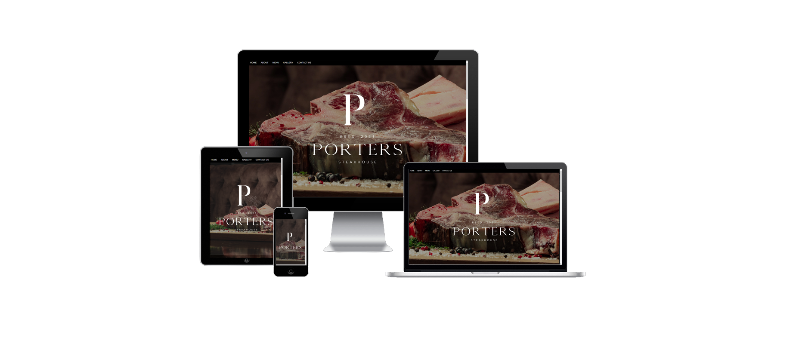
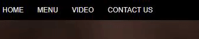
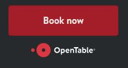
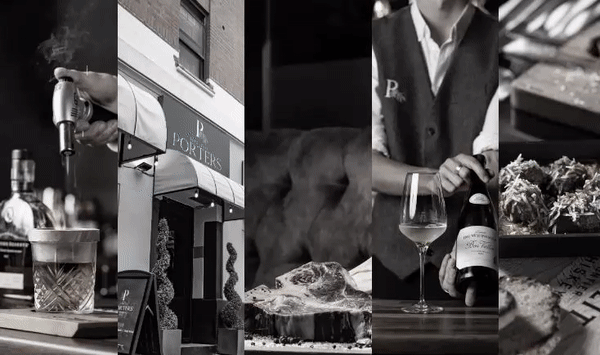
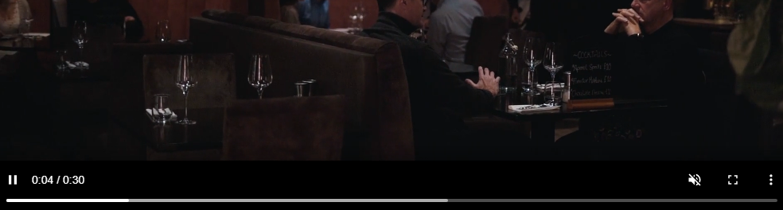

# Portfolio Project 1 - HTML/CSS Essentials

## Live Site
Porters Steakhouse - [###](###)

## Repository
[https://github.com/chrislawbuary/CI_Project1](https://github.com/chrislawbuary/CI_Project1)

***
## Objective
In this project I intend the create a website for the restaurant "Porters Steakhouse"
The main objective is to demonstrate competency in HTML and CSS. 
The website is designed to be responsive between different devices and the use of the site to be intuitive by any user.

***
## Design

### Wireframes

...

### Colour Scheme
A simple dark colour scheme has been used.\
Looking at the overall design of the resaurant interior I felt a dark colour scheme would work best.\
Using these colours it draws the users attention to the large images and focus on the food.

### Typography
\
I have used two fonts for this website, Amiri and Montserrat.\
I chose Amiri as I felt it worked best with the restaurants exisiting logo.\
And Monsterrat is a very easy to read and clean looking font which I thought suited this website.

### Imagery
The main focus of this website it too show of the food and feel of the restaurant.\
Large scale images were used to catch the users eye immediatly and keep their attention.

***
## Features

### Existing Features

#### Responsive
- Responsive on all device sizes.

#### Nav Bar / Menu

- The Nav bar is sticky to the top of the page.
- As you move the cursor over the choice the colour will change helping the user see what they are selecting.

#### Nav Bar / Menu

- I have added a booking widget from OpenTable [https://www.opentable.co.uk/widget/reservation/preview]
- This ensures when a user visits the site, they have a quick and convienent way to book a table

#### Gallery

- I initially planned for a seperate gallery page but when I came across this page [https://css-tricks.com/zooming-images-in-a-grid-layout/] I followed the steps to create my own move over zooming gallery.
- This design taught me how to use custom variables within my CSS.

#### Video and Controls
\
- I have created a video page with interactive controls for the user.

***
## Technologies Used

### Languages Used
- [HTML](https://en.wikipedia.org/wiki/HTML5)
- [CSS3](https://en.wikipedia.org/wiki/CSS)

***
## Testing

...

***
## Bugs

### Current
There are currently no bugs I am aware of.

***

## Credits
- [CodeInstitute](https://codeinstitute.net/) for teach me the skills to build this website
- [W3Schools](https://www.w3schools.com/) for helping to further my skills 
- [Google Fonts](https://fonts.google.com/) for my fonts
- [CSS Tricks](https://css-tricks.com/zooming-images-in-a-grid-layout/) for helping me create the gallery
- [OpenTable](https://www.opentable.co.uk/widget/reservation/preview) for the restaurant booking widget